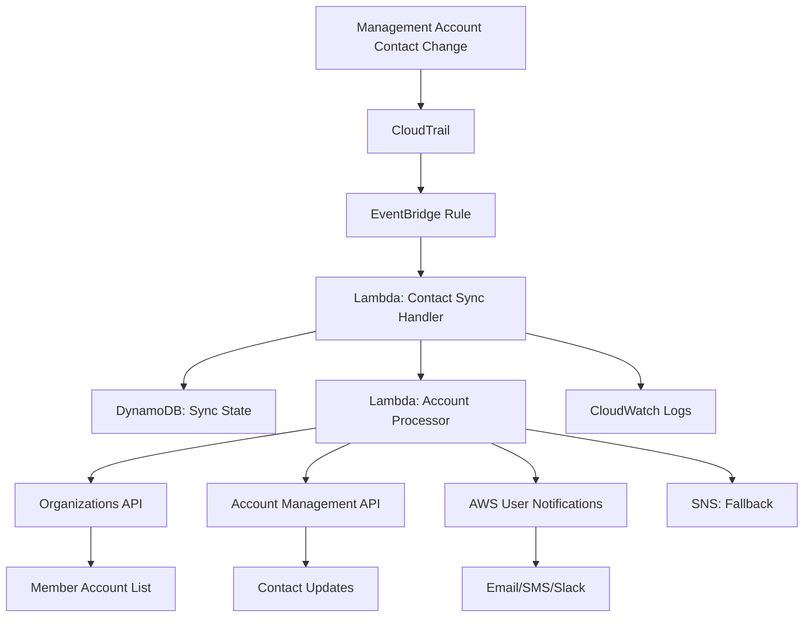

# Design Document: AWS Contact Synchronization

## Overview

The AWS Contact Synchronization system is a serverless application built with Python that automatically detects and propagates contact information changes from an AWS organization's management account to all member accounts. The system uses AWS Lambda functions triggered by CloudTrail events via EventBridge to ensure near real-time synchronization of both primary and alternate contact information.

## Architecture

The system follows an event-driven serverless architecture using the following AWS services:



### Key Components

1. **Event Detection**: CloudTrail captures Account Management API calls, EventBridge routes contact-related events to Lambda
2. **Orchestration**: Main Lambda function coordinates the synchronization process
3. **Processing**: Worker Lambda functions handle individual account updates with retry logic
4. **State Management**: DynamoDB tracks synchronization status and configuration
5. **Monitoring**: CloudWatch Logs and SNS notifications provide visibility and alerting

## Components and Interfaces

### 1. Contact Sync Handler (Lambda Function)

**Purpose**: Main orchestrator that receives contact change events and initiates synchronization

**Interfaces**:
- **Input**: EventBridge events from CloudTrail containing Account Management API calls
- **Output**: Invokes Account Processor Lambda functions for each member account

**Key Functions**:
- Parse contact change events from CloudTrail
- **Critical filtering**: Only process events where `requestParameters.accountId` is absent (management account operations only)
- Note: `recipientAccountId` is always the management account ID regardless of which account is being updated
- Retrieve organization member accounts using Organizations API
- Filter accounts based on configuration (exclusion list)
- Initiate parallel processing of member accounts
- Track overall synchronization status

### 2. Account Processor (Lambda Function)

**Purpose**: Handles contact updates for individual member accounts with retry logic

**Interfaces**:
- **Input**: Account ID, contact information, and sync metadata
- **Output**: Success/failure status and detailed logs

**Key Functions**:
- Use Account Management API from management account to update member account contacts
- Retrieve current contact information from target account via Organizations API
- Compare and update contact information if different
- Implement exponential backoff retry logic
- Log detailed results for audit purposes

### 3. Configuration Manager

**Purpose**: Manages synchronization settings and account exclusions

**Interfaces**:
- **Storage**: DynamoDB table for configuration data
- **API**: Functions to read/write configuration settings

**Configuration Schema**:
```python
{
    "contact_types": ["primary", "billing", "operations", "security"],
    "excluded_accounts": ["123456789012", "234567890123"],
    "retry_config": {
        "max_attempts": 3,
        "base_delay": 2,
        "max_delay": 60
    },
    "notification_settings": {
        "user_notifications_config": {
            "notification_hub_region": "us-east-1",
            "delivery_channels": ["EMAIL", "SMS", "SLACK"],
            "notification_rules": {
                "high_priority": ["complete_failure", "permission_errors", "system_errors"],
                "medium_priority": ["partial_failure", "configuration_errors"],
                "low_priority": ["success_completion"]
            }
        },
        "fallback_sns_topic": "arn:aws:sns:...",  # Fallback if User Notifications unavailable
        "notify_on_failure": True,
        "notify_on_success": False,
        "notify_on_partial_failure": True,
        "failure_threshold": 1  # Notify if any account fails
    }
}
```

**Notification Scenarios**:
- **Complete Failure**: When synchronization fails for all member accounts (High Priority)
- **Partial Failure**: When synchronization fails for some but not all member accounts (Medium Priority)
- **Permission Errors**: When the service lacks permissions to update specific accounts (High Priority)
- **Configuration Errors**: When invalid configuration prevents synchronization (Medium Priority)
- **System Errors**: When infrastructure issues (Lambda timeouts, DynamoDB errors) occur (High Priority)
- **Success Notifications**: Optionally notify on successful completion (Low Priority, disabled by default)

**Notification Delivery**:
- **Primary**: AWS User Notifications service with configurable delivery channels (email, SMS, Slack, etc.)
- **Priority-based routing**: Different notification types routed based on severity level
- **Fallback**: SNS topic as backup delivery mechanism if User Notifications is unavailable
- **Rich formatting**: Structured notifications with account details, error messages, and remediation suggestions

### 4. State Tracker

**Purpose**: Tracks synchronization operations and provides audit trail

**Interfaces**:
- **Storage**: DynamoDB table for sync state and history
- **API**: Functions to create, update, and query sync operations

**State Schema**:
```python
{
    "sync_id": "uuid",
    "timestamp": "2024-01-09T10:00:00Z",
    "initiating_user": "arn:aws:iam::...",
    "contact_type": "primary",
    "source_account": "123456789012",
    "target_accounts": ["234567890123", "345678901234"],
    "status": "in_progress",
    "results": {
        "234567890123": {"status": "success", "timestamp": "..."},
        "345678901234": {"status": "failed", "error": "...", "retry_count": 2}
    }
}
```

## Data Models

### Contact Information Model

Based on the AWS Account Management API structure:

```python
@dataclass
class ContactInformation:
    address_line1: str
    address_line2: Optional[str] = None
    address_line3: Optional[str] = None
    city: str
    company_name: Optional[str] = None
    country_code: str
    district_or_county: Optional[str] = None
    full_name: str
    phone_number: str
    postal_code: str
    state_or_region: Optional[str] = None
    website_url: Optional[str] = None
```

### Alternate Contact Model

```python
@dataclass
class AlternateContact:
    contact_type: Literal["BILLING", "OPERATIONS", "SECURITY"]
    email_address: str
    name: str
    phone_number: str
    title: str
```

### Sync Operation Model

```python
@dataclass
class SyncOperation:
    sync_id: str
    timestamp: datetime
    initiating_user: str
    contact_type: str
    source_account: str
    target_accounts: List[str]
    status: Literal["pending", "in_progress", "completed", "failed"]
    contact_data: Union[ContactInformation, AlternateContact]
    results: Dict[str, AccountSyncResult]
    
@dataclass
class AccountSyncResult:
    account_id: str
    status: Literal["success", "failed", "skipped"]
    timestamp: datetime
    error_message: Optional[str] = None
    retry_count: int = 0
```

## Correctness Properties

*A property is a characteristic or behavior that should hold true across all valid executions of a system—essentially, a formal statement about what the system should do. Properties serve as the bridge between human-readable specifications and machine-verifiable correctness guarantees.*

### Property 1: Contact Change Detection Timing
*For any* contact information change (primary or alternate) in the management account, the Contact_Sync_Service should detect the change within 5 minutes regardless of the contact type or number of fields modified
**Validates: Requirements 1.1, 1.2, 1.3**

### Property 2: Contact Information Propagation Consistency
*For any* detected contact change in the management account, the same contact information should be successfully applied to all non-excluded member accounts, preserving contact type and field values
**Validates: Requirements 2.1, 2.2, 2.3**

### Property 3: Retry Logic with Exponential Backoff
*For any* member account that experiences temporary failures, the system should retry updates exactly 3 times with exponential backoff delays (2s, 4s, 8s) before marking the account as failed
**Validates: Requirements 3.1**

### Property 4: Resilient Processing
*For any* synchronization operation where some member accounts fail, the system should continue processing all remaining accounts and complete the operation for successful accounts
**Validates: Requirements 2.4, 3.2**

### Property 5: Comprehensive Audit Logging
*For any* synchronization operation (successful or failed), the system should log all required audit information including timestamp, initiating user, source account, target accounts, changed fields, and error details where applicable
**Validates: Requirements 4.1, 4.2**

### Property 6: Configuration-Based Filtering
*For any* synchronization operation, only contact types specified in the configuration should be synchronized, and accounts in the exclusion list should be skipped entirely
**Validates: Requirements 5.1, 5.2**

### Property 7: Configuration Validation and Isolation
*For any* configuration change, invalid configurations should be rejected before application, and changes should only affect future operations without disrupting in-progress synchronizations
**Validates: Requirements 5.3, 5.4**

### Property 8: Status Reporting Completeness
*For any* completed synchronization operation, the system should generate a comprehensive report showing the status (success/failure/skipped) for each target account along with relevant timestamps and error details
**Validates: Requirements 2.5, 3.3**

## Error Handling

The system implements comprehensive error handling at multiple levels:

### 1. Event Processing Errors
- **CloudTrail Event Parsing**: Malformed events are logged and discarded
- **Event Filtering**: Member account contact changes filtered out to prevent infinite loops
- **EventBridge Delivery**: Failed deliveries trigger DLQ processing with manual review
- **Lambda Invocation**: Cold start timeouts and memory issues trigger automatic retries

### 2. API Call Errors
- **Organizations API**: Rate limiting handled with exponential backoff
- **Account Management API**: Permission errors logged and accounts skipped
- **Member Account Updates**: Failed updates via Organizations API logged with specific error codes

### 3. Data Consistency Errors
- **Contact Information Validation**: Invalid contact data rejected with detailed error messages
- **Account State Conflicts**: Concurrent modifications detected and handled with optimistic locking
- **Configuration Conflicts**: Invalid configurations rejected during validation phase

### 4. Infrastructure Errors
- **DynamoDB Throttling**: Automatic retries with exponential backoff
- **Lambda Timeout**: Operations split into smaller batches for large organizations
- **Network Connectivity**: Temporary failures trigger retry logic with circuit breaker pattern

## Testing Strategy

The testing approach combines unit tests for specific functionality with property-based tests for comprehensive validation across all possible inputs.

### Unit Testing
- **Event Parsing**: Test specific CloudTrail event formats and edge cases
- **API Integration**: Test individual AWS API calls with mocked responses
- **Configuration Validation**: Test specific valid and invalid configuration scenarios
- **Error Handling**: Test specific error conditions and recovery mechanisms

### Property-Based Testing
- **Contact Synchronization**: Generate random contact information and verify propagation consistency
- **Retry Logic**: Generate random failure scenarios and verify retry behavior
- **Configuration Filtering**: Generate random configurations and verify filtering behavior
- **Audit Logging**: Generate random operations and verify log completeness

**Testing Framework**: pytest with Hypothesis for property-based testing
**Test Configuration**: Minimum 100 iterations per property test
**Test Tagging**: Each property test tagged with format: **Feature: aws-contact-sync, Property {number}: {property_text}**

### Integration Testing
- **End-to-End Flows**: Test complete synchronization workflows using test AWS accounts
- **Organizations API Access**: Verify management account can update member account contacts
- **Event-Driven Architecture**: Test EventBridge rule matching and Lambda triggering
- **State Management**: Test DynamoDB operations under concurrent access patterns

### Performance Testing
- **Large Organizations**: Test synchronization performance with 100+ member accounts
- **Concurrent Operations**: Test system behavior under multiple simultaneous sync operations
- **Rate Limiting**: Verify system respects AWS API rate limits and implements backoff correctly